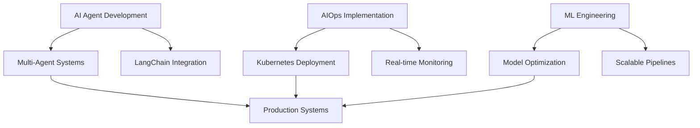

# Tafar A.k.a (dyglo)

  <h2> AI Engineer | AIOps Practitioner | Machine Learning Innovator</h2>
  
<em>Building the future of AI-driven automation systems</em>

  
  
  
  
  

---

## Tech Stack

### **AI & Machine Learning**

### **AI Frameworks & Tools**

### **DevOps & Cloud**

### **Development**

---

## Current Focus Areas

  

---

## Let's Connect & Collaborate

  

    <strong>Open to:</strong> AI Agent collaborations • AIOps consulting • Technical discussions • Open source contributions
  

  
  

    <em>"Building intelligent systems that don't just work, but evolve and adapt."</em>
  

  
   
  
  

---

  Built by Dyglo

